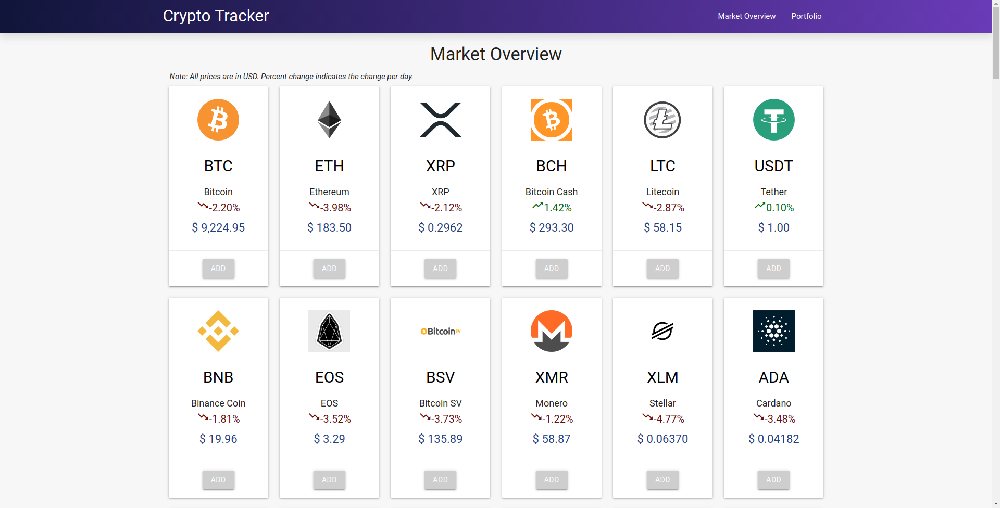
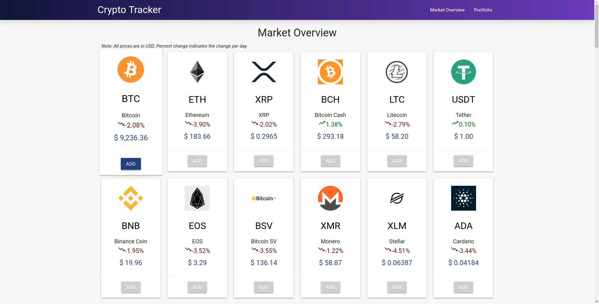
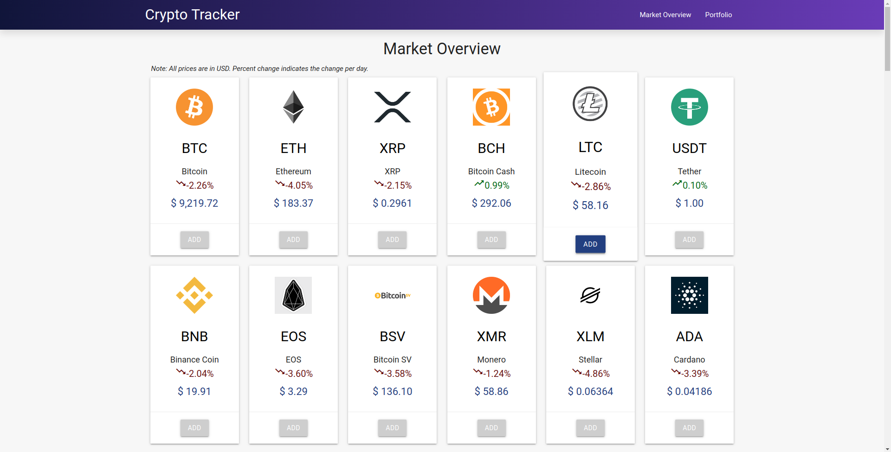

# CryptoTracker
A react app that tracks your cryptocurrency investments (with realtime updates
    to prices, daily % change, and more).

## Index
- [Features](https://github.com/shub-sharma/CryptoTracker#features)
- [Upcoming Features](https://github.com/shub-sharma/CryptoTracker#upcoming-features)
- [Screenshots](https://github.com/shub-sharma/CryptoTracker#screenshots)
- [Built Using](https://github.com/shub-sharma/CryptoTracker#built-using)

## Features
* Real-time price updates via CryptoCompare api (10 seconds caching limit)
* Can load up to 500+ cryptocurrencies which must be specified in a seperate
JSON file (e.g. ```Top100Coins.json```)
* Sleek UI built using Materialize CSS + cool and responsive transitions

## Upcoming Features
* Add Google OAuth for authentication
* Use a database to store the investment details for users after authentication

## Screenshots
_No hover Market Overview page_

_Hover BTC Market Overview page_

_Hover LTC Market Overview page_


## Built Using
- [React](https://reactjs.org/)
- [CryptoCompare API](https://www.cryptocompare.com/)
- [Materialize CSS](https://materializecss.com/getting-started.html)
